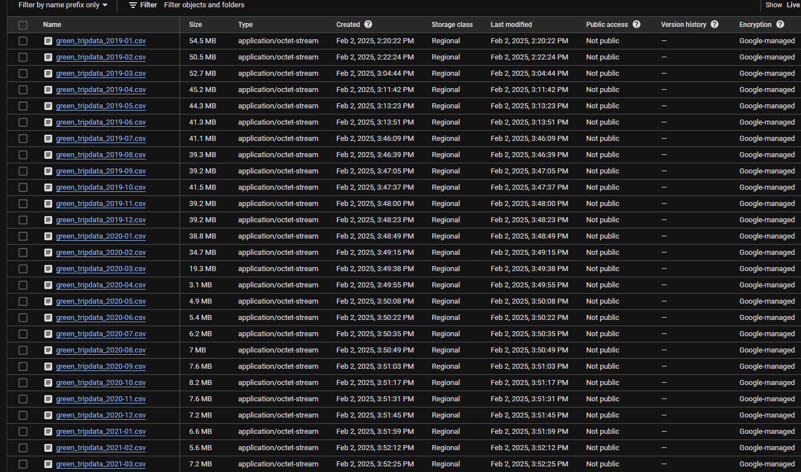

# Module 2 Homework Answers: Workflow Orchestration

## Assignment
I used my own modified flow file **[GCP_Flow](gcp_taxi_scheduled.yaml)** to backfill all of the data to GCS 

##  Challenge for you: find out how to loop over the combination of Year-Month and taxi-type using ForEach task which triggers the flow for each combination using a Subflow task.

 This flow file can be used to automate main flow running **[GCP_Loop](gcp_loop.yaml)** 
## Quiz Questions

 1. Within the execution for `Yellow` Taxi data for the year `2020` and month `12`: what is the uncompressed file size (i.e. the output file `yellow_tripdata_2020-12.csv` of the `extract` task)?

Answer: **`128.3 MB`**
----

 2. What is the rendered value of the variable `file` when the inputs `taxi` is set to `green`, `year` is set to `2020`, and `month` is set to `04` during execution?

Answer: **`green_tripdata_2020-04.csv`**
----

 3. How many rows are there for the `Yellow` Taxi data for all CSV files in the year 2020?

Answer: **`24,648,499`**
----

 4. How many rows are there for the `Green` Taxi data for all CSV files in the year 2020?

Answer: **`1,734,051`**
----

 5. How many rows are there for the `Yellow` Taxi data for the March 2021 CSV file?

Answer: **`1,925,152`**
----

 6. How would you configure the timezone to New York in a Schedule trigger?

Answer: **Add a `timezone` property set to `America/New_York` in the `Schedule` trigger configuration**
