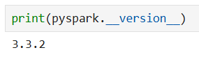
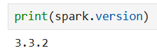
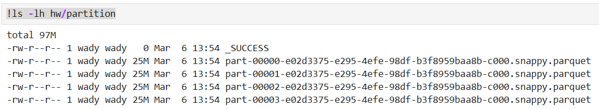
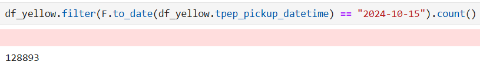
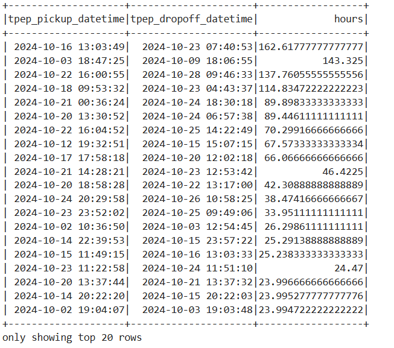
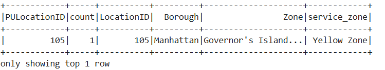

# Module 5 Homework Answers: Batch Processing

## Question 1: Install Spark and PySpark

```python
import pyspark
from pyspark.sql import SparkSession
spark = SparkSession.builder \
    .master("local[*]") \
    .appName('Module_4_HW') \
    .getOrCreate()

print(pyspark.__version__)
print(spark.version)
```
 

<span style="font-size: 18px;">Answer: **`3.3.2`**</span>

## Question 2: Yellow October 2024

```python
df_yellow = spark.read.parquet('yellow_tripdata_2024-10.parquet')
df_yellow_4 = df_yellow.repartition(4)
df_yellow_4.write.parquet('hw/partition')

!ls -lh hw/partition
```


<span style="font-size: 18px;">Answer: **`25MB`**</span>

## Question 3: Count records

```python
from pyspark.sql import functions as F

df_yellow \
    .filter(F.to_date(df_yellow.tpep_pickup_datetime) == "2024-10-15") \
    .count()
```



Note: I have chosen the closest one despite it is not identical.

<span style="font-size: 18px;">Answer: **`125,567`**</span>

## Question 4: Longest trip

```python
df_yellow \
    .withColumn("hours", ((df_yellow.tpep_dropoff_datetime) - (df_yellow.tpep_pickup_datetime)).cast('long') / 3600 )\
    .select('tpep_pickup_datetime','tpep_dropoff_datetime','hours') \
    .sort(F.desc('hours')) \
    .show()
```



<span style="font-size: 18px;">Answer: **`162`**</span>

## Question 5: User Interface

<span style="font-size: 18px;">Answer: **`4040`**</span>

## Question 6: Least frequent pickup location zone

```python
!wget https://d37ci6vzurychx.cloudfront.net/misc/taxi_zone_lookup.csv

df_zones = spark.read \
    .option("header", "true") \
    .csv('taxi_zone_lookup.csv')

df_count = df_yellow \
    .groupby('PULocationID') \
    .count()

df_result = df_count \
    .join(df_zones, df_count.PULocationID == df_zones.LocationID) \
    .sort('count')

df_result.show(1)
```



<span style="font-size: 18px;">Answer: **`Governor's Island/Ellis Island/Liberty Island`**</span>
