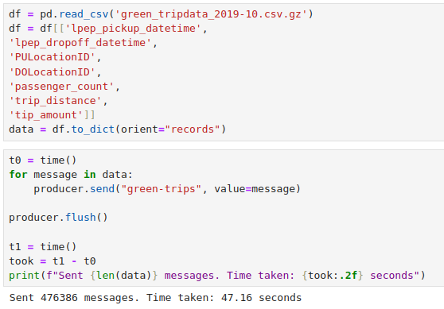
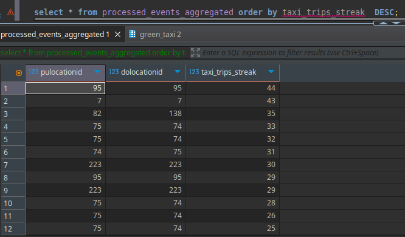

# Module 6 Homework Answers: Stream Processing

## Question 1: Redpanda version

```bash
rpk version
```
<span style="font-size: 18px;">Output:</span>
```bash
Version:     v24.2.18
Git ref:     f9a22d4430
Build date:  2025-02-14T12:52:55Z
OS/Arch:     linux/amd64
Go version:  go1.23.1

Redpanda Cluster
  node-1  v24.2.18 - f9a22d443087b824803638623d6b7492ec8221f9
```

## Question 2. Creating a topic

```shell
rpk topic create "green-trips"
```
<span style="font-size: 18px;">Output:</span>
```bash
TOPIC        STATUS
green-trips  OK
```

## Question 3. Connecting to the Kafka server

```python
import json

from kafka import KafkaProducer

def json_serializer(data):
    return json.dumps(data).encode('utf-8')

server = 'localhost:9092'

producer = KafkaProducer(
    bootstrap_servers=[server],
    value_serializer=json_serializer
)

producer.bootstrap_connected()
```
<span style="font-size: 18px;">Output:</span>
```python
True
```

## Question 4: Sending the Trip Data

```python
df = pd.read_csv('green_tripdata_2019-10.csv.gz')
df = df[['lpep_pickup_datetime',
'lpep_dropoff_datetime',
'PULocationID',
'DOLocationID',
'passenger_count',
'trip_distance',
'tip_amount']]

data = df.to_dict(orient="records")

t0 = time()
for message in data:

    producer.send("green-trips", value=message)

producer.flush()

t1 = time()
took = t1 - t0
print(f"Sent {len(data)} messages. Time taken: {took:.2f} seconds")
```



<span style="font-size: 18px;">Answer: **`47.16 seconds`**</span>

## Question 5: Build a Sessionization Window (2 points)

- Check the pyflink code file **[Session Job](session_job.py)**

- Create the sink table
```sql
CREATE TABLE processed_events_aggregated (
    PULocationID INT,
    DOLocationID INT,
    taxi_trips_streak BIGINT
);
```



<span style="font-size: 18px;">Answer:</span>

<span style="font-size: 18px;">`From PULocationID: 95 "Forest Hills"`</span>

<span style="font-size: 18px;">`To DOLocationID: 95 "Forest Hills"`</span>

<span style="font-size: 18px;">`The Streak is 44 trips`</span>
